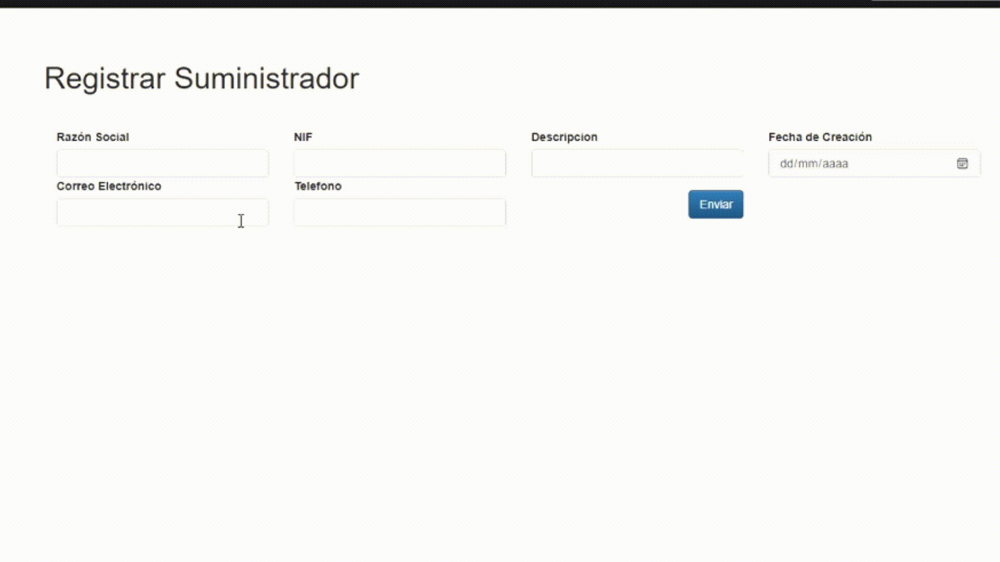

# Proyecto de conocimiento: AgriTechERP.Web
 Proyecto Enterprise Resource Planning (ERP) para una empresa de ejemplo AgriTech que se dedica a los productos agrícolas y tecnológicas con la finalidad de mejorar el sector de agrícultura nacional e internacional.  

## Módulo 1: Adquisición 

El módulo de Adquisición compone de submódulos que interactúan entre sí y son: Portal Suministrador, Productos Suministrador, Ordenes en Carrito, etc. Además, este módulo puede relacionar con otros módulos.

<h3>Portal Suministrador</h3>

